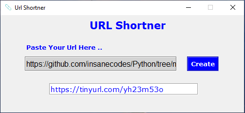

# URL-Shortener-GUI [](https://forthebadge.com)

[](https://github.com/insanecodes/URL-Shortener-GUI)
[](https://github.com/insanecodes/URL-Shortener-GUI/fork)
<br>
A URL Shortener GUI Made Using Python 3.9.0 .<br>
It reduces the length of the URL so that it can be shared easily on platforms like Twitter, where number of characters is an issue.<br>
Hope You Will Like It and you can also use the code to make your own version.

>#### To Run, simply open your terminal and go the source directory and type ``python main.py``.
## Requirements
1.  pyshorteners

---

### Installing The pyshorteners Module:
* For Linux: Open Terminal then type ```pip3 install pyshorteners```
* For Windows: Open CMD, then type ```pip install pyshorteners```


---
## Demo


<div align="center">

### Show some ❤️ by starring the repository!

</div>
